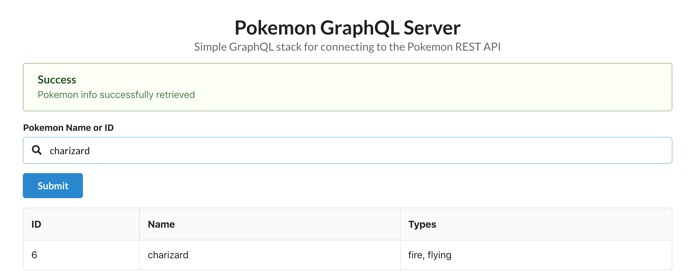
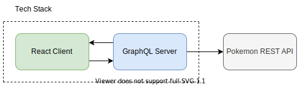

# Pokemon GraphQL Server

Simple GraphQL stack for connecting to the pokemon REST API. Search for pokemon info by name or ID.



## Architecture Overview



## Getting Started

These instructions will get you a copy of the project up and running on your local machine.

### Prerequisites

To write and test code you will need [NodeJS](https://nodejs.org/en/) and [Yarn](https://yarnpkg.com/lang/en/) installed. If your on a Mac, use [Homebrew](https://docs.brew.sh/Installation) for installation.

```shell
brew install node
brew install yarn
```

Will also need [TypeScript](https://www.typescriptlang.org/) installed.

```shell
npm install -g typescript
```

### Installing

Install project dependencies

```shell
yarn
```

## Tests

### Unit Tests

Unit tests use [jest](https://facebook.github.io/jest/). Tests can be run globally from the root directory by running:

```shell
yarn test
```

### Integration Tests

```shell
yarn test:integration
```

### E2E Tests

End to end tests use [Cypress](https://www.cypress.io/). Tests can be run globally from the root directory by running:

```shell
yarn test:e2e
```

To visually see the tests running in browser:

```shell
yarn cypress:open
```

### Coding Style Tests

Code style is enforced by using a linter ([eslint](https://eslint.org/)) and [Prettier](https://prettier.io/).

```shell
yarn lint
```

### Generated Types

The React client uses data-types generated from the GraphQL schemas.

```shell
cd client
yarn build:types
```

## Built With

### Languages / Core Tools

- [Typescript](http://www.typescriptlang.org/) - The primary language
- [React](https://reactjs.org/) - A JavaScript library for building user interfaces

### Secondary Tooling

- [jest](https://jestjs.io/) - Unit and integration testing framework
- [lerna](https://github.com/lerna/lerna) - Managing multi package repo's
- [yarn](https://yarnpkg.com/lang/en/) - Typescript package management
- [express](https://github.com/expressjs/express) - rest service framework
- [GraphQL](https://graphql.org/) - API specification
- [Semantic UI React](https://react.semantic-ui.com/) - Framework for styling user interfaces

## Using the App

Change to the root directory and run `yarn start`

```shell
yarn start
```

## Versioning

There are no particular versioning systems in use.

## Authors


**Theodore Jones** - [MrKiplin](https://github.com/MrKiplin)
